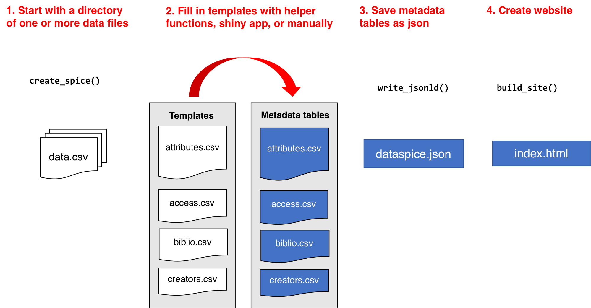

<!-- README.md is generated from README.Rmd. Please edit that file -->

```{r setup, include = FALSE}
knitr::opts_chunk$set(
  collapse = TRUE,
  comment = "#>",
  fig.path = "man/figures/README-",
  out.width = "100%"
)
library(knitr)
library(kableExtra)
library(magrittr)
library(stringr)
```
# dataspice

[](https://travis-ci.com/ropenscilabs/dataspice)

The goal of dataspice is to make it easier for researchers to create basic, lightweight and concise metadata files for their datasets. These basic files can then be used to:

- make useful information available during analysis.
- create a helpful dataset README webpage.
- produce more complex metadata formats to aid dataset discovery.

Metadata fields are based on [schema.org](http://schema.org/Dataset) and other [metadata standards](https://github.com/ropenscilabs/dataspice#resources).

## Example

A fully worked example can be found [here](https://github.com/amoeba/dataspice-example) and a live preview of the output [here](https://amoeba.github.io/dataspice-example/). An example of how Google sees this can be found [here](https://search.google.com/structured-data/testing-tool/u/0/#url=https%3A%2F%2Famoeba.github.io%2Fdataspice-example%2F).

## Installation

You can install the development version from [GitHub](https://github.com/) with:

``` r
# install.packages("devtools")
devtools::install_github("ropenscilabs/dataspice")
```
## Workflow

```{r example, eval=FALSE}
create_spice()
write_spice() 
build_site()
```



### Create spice

* `create_spice()` creates template metadata spreadsheets in a folder (by default created in the `data` folder)

The template files are:

* **attributes.csv** - explains each of the variables in the dataset
* **biblio.csv** - for spatial and temporal coverage, dataset name, keywords, etc.
* **access.csv** - for files and file types
* **creators.csv** - for data authors

### Fill in templates

The user needs to fill in the details of the 4 template files. These csv files can be directly modified, or they can be edited using some helper functions and/or a shiny app. 

#### Helper functions

* `prep_attributes()` populates the **`fileName`** and **`variableName`** columns of the `attributes.csv` file using the header row of the data files. 

* `prep_access()` populates the **`fileName`**, **`name`** and **`fileFormat`** columns of the `access.csv` file from the files in the folder containing the data. 


<br>

To see an example of how `prep_attributes()` works, load the data files that ship with the package:

```{r, eval=FALSE}
data_files <- list.files(system.file("example-dataset/", 
                                     package = "dataspice"), 
                         pattern = ".csv",
                        full.names = TRUE)
```

This function assumes that the metadata templates are in a folder called `metadata` within a `data` folder.

```{r, eval = FALSE}
attributes_path <- here::here("data", "metadata",
 "attributes.csv")
```

Using `purrr::map()`, this function can be applied over multiple files to populate the header names

```{r, eval=FALSE, message=FALSE}
data_files %>% purrr::map(~prep_attributes(.x, attributes_path),
                         attributes_path = attributes_path)
```

The output of `prep_attributes()` has the first two columns filled out:

```{r, echo=FALSE, message=FALSE}
readr::read_csv(system.file("metadata-tables/attributes_prepped.csv", package = "dataspice")) %>% head() %>% kable()
```

<br>

#### editable shiny apps

Each of the metadata templates can be edited interactively using a shiny app

* `edit_attributes()` opens a shiny app that can be used to edit `attributes.csv`. The shiny app displays the current `attributes` table and lets the user fill in an informative description and units (e.g. meters, hectares, etc.) for each variable. 
* `edit_access()`: opens an editable version of `access.csv`
* `edit_creators()`: opens an editable version of `creators.csv`
* `edit_biblio()`: opens an editable version of `biblio.csv`


Remember to click on **Save** when finished editing.

<br>

#### completed metadata files

The first few rows of the completed metadata tables in this example will look like this:

`access.csv` has one row for each file

```{r, echo=FALSE, message=FALSE}
readr::read_csv(system.file("metadata-tables/access.csv", package = "dataspice")) %>% head() %>% kable(format = "markdown")
```

<br>

`attributes.csv` has one row for each variable in each file

```{r, echo=FALSE, message=FALSE}
readr::read_csv(system.file("metadata-tables/attributes.csv", package = "dataspice")) %>% head() %>% kable(format = "markdown")
```

<br>

`biblio.csv` is one row containing descriptors including spatial and temporal coverage

```{r, echo=FALSE, message=FALSE, warning=FALSE}
readr::read_csv(system.file("metadata-tables/biblio.csv", package = "dataspice")) %>% 
  dplyr::mutate(description = str_trunc(description, 200, side = "right")) %>%
  kable(format = "markdown")
```

<br>

`creators.csv` has one row for each of the dataset authors

```{r, echo=FALSE, message=FALSE}
readr::read_csv(system.file("metadata-tables/creators.csv", package = "dataspice")) %>% 
  kable(format = "markdown") 
```

<br>

***

### Save json-ld file

* `write_spice()` generates a json-ld file ("linked data") to aid in [dataset discovery](https://developers.google.com/search/docs/data-types/dataset), creation of more extensive metadata (e.g. [EML](https://knb.ecoinformatics.org/#api)), and creating a website. 

Here's a view of the `dataspice.json` file of the example data:

```{r, echo = F}
jsonlite::read_json(system.file("metadata-tables/dataspice.json", 
                                     package = "dataspice")) %>% 
  listviewer::jsonedit()
```


<br>

***

### Build website

* `build_site()` generates an index.html file in the repository `docs` folder, to create a website that shows a simple view of the dataset with the metadata and an interactive map. For example, this [repository](https://github.com/amoeba/dataspice-example) results in this [website](https://amoeba.github.io/dataspice-example/) 


<br>

***

## Resources
A few existing tools & data standards to help users in specific domains:

* [Darwin Core](http://rs.tdwg.org/dwc/)
* [Ecological Metadata Language](https://knb.ecoinformatics.org/#external//emlparser/docs/index.html) (EML) (& [`EML`](https://github.com/ropensci/EML))
* [ISO 19115](https://www.iso.org/standard/53798.html) - Geographic Information Metadata
* [ISO 19139](https://www.iso.org/standard/32557.html) - Geographic Info Metadata XML schema
* [Minimum Information for Biological and Biomedical Investigations](https://fairsharing.org/collection/MIBBI) (MIBBI)

...And others indexed in [Fairsharing.org](https://fairsharing.org) & the [RDA metadata directory](http://rd-alliance.github.io/metadata-directory/standards/). 

## Contributors

This package was developed at rOpenSci's 2018 unconf by (in alphabetical order):

* [Carl Boettiger](https://github.com/cboettig)
* [Scott Chamberlain](https://github.com/sckott)
* [Auriel Fournier](https://github.com/aurielfournier)
* [Kelly Hondula](https://github.com/khondula)
* [Anna Krystalli](https://github.com/annakrystalli)
* [Bryce Mecum](https://github.com/amoeba)
* [Maëlle Salmon](https://github.com/maelle)
* [Kate Webbink](https://github.com/magpiedin)
* [Kara Woo](https://github.com/karawoo)

