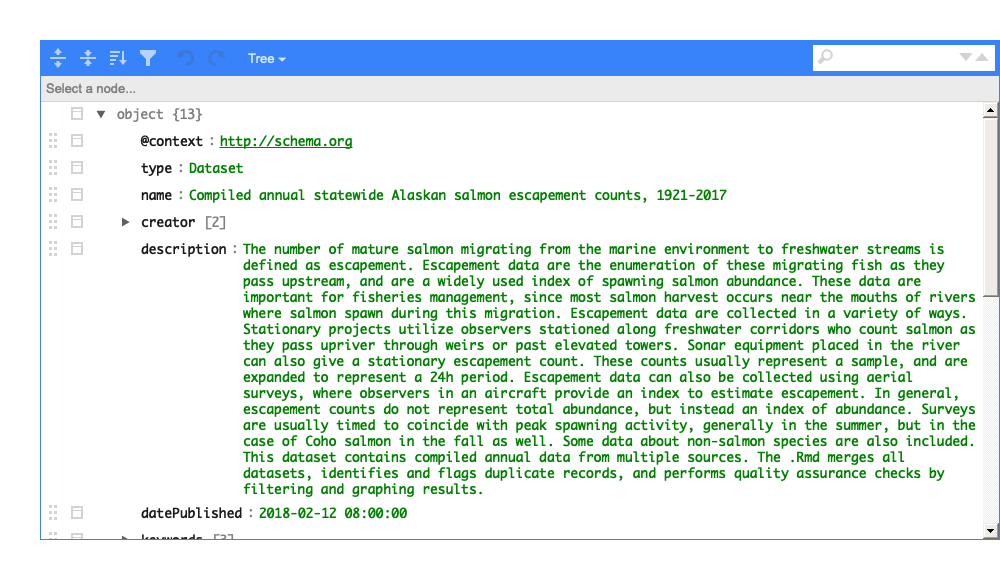

---
output:
  md_document:
    variant: gfm
---

<!-- README.md is generated from README.Rmd. Please edit that file -->

```{r setup, include = FALSE}
knitr::opts_chunk$set(
  collapse = TRUE,
  comment = "#>",
  fig.path = "man/figures/README-",
  out.width = "100%"
)
library(knitr)
library(kableExtra)
library(magrittr)
library(stringr)
```
# dataspice

[](https://travis-ci.com/ropenscilabs/dataspice)

The goal of `dataspice` is to make it easier for researchers to create basic, lightweight, and concise metadata files for their datasets by editing the kind of files they're probably most familiar with: CSVs. These metadata files can then be used to:

- Make useful information available during analysis.
- Create a helpful dataset README webpage for your data similar to how [pkgdown](https://pkgdown.r-lib.org/) creates websites for R packages.
- Produce more complex metadata formats for richer description of your datasets and to aid dataset discovery.

Metadata fields are based on [Schema.org/Dataset](http://schema.org/Dataset) and other [metadata standards](https://github.com/ropenscilabs/dataspice#resources) and represent a lowest common denominator which means converting between formats should be relatively straightforward.

## Example

A fully worked example can be found [here](https://github.com/amoeba/dataspice-example) and a live preview of the output [here](https://amoeba.github.io/dataspice-example/). An example of how Google sees this can be found [here](https://search.google.com/structured-data/testing-tool/u/0/#url=https%3A%2F%2Famoeba.github.io%2Fdataspice-example%2F).

## Installation

You can install the development version from [GitHub](https://github.com/) with:

``` r
# install.packages("devtools")
devtools::install_github("ropenscilabs/dataspice")
```

## Workflow

```{r example, eval=FALSE}
create_spice()
# Then fill in template CSV files
write_spice()
build_site() # Optional
```


### Create spice

`create_spice()` creates template metadata spreadsheets in a folder (by default created in the `data` folder in the current working directory).

The template files are:

* **biblio.csv** - for title, abstract, spatial and temporal coverage, etc.
* **creators.csv** - for data authors
* **attributes.csv** - explains each of the variables in the dataset
* **access.csv** - for files, file types, and download URLs (if appropriate)

### Fill in templates

The user needs to fill in the details of the four template files. These csv files can be directly modified, or they can be edited using either the associated helper function and/or [Shiny](https://shiny.rstudio.com/) app.

#### Helper functions

* `prep_attributes()` populates the **`fileName`** and **`variableName`** columns of the `attributes.csv` file using the header row of the data files.

* `prep_access()` populates the **`fileName`**, **`name`** and **`encodingFormat`** columns of the `access.csv` file from the files in the folder containing the data.

To see an example of how `prep_attributes()` works, load the data files that ship with the package:

```{r, eval=FALSE}
data_files <- list.files(system.file("example-dataset/", package = "dataspice"),
                         pattern = ".csv",
                         full.names = TRUE)
```

This function assumes that the metadata templates are in a folder called `metadata` within a `data` folder.

```{r, eval = FALSE}
attributes_path <- file.path("data", "metadata", "attributes.csv")
```

Using `purrr::map()`, this function can be applied over multiple files to populate the header names

```{r, eval=FALSE, message=FALSE}
data_files %>%
  purrr::map(~ prep_attributes(.x, attributes_path),
             attributes_path = attributes_path)
```

The output of `prep_attributes()` has the first two columns filled out:

```{r, echo=FALSE, message=FALSE}
readr::read_csv(
  system.file(
    "metadata-tables/attributes_prepped.csv",
    package = "dataspice")) %>%
  head() %>%
  kable()
```

#### Shiny helper apps

Each of the metadata templates can be edited interactively using a [Shiny](https://shiny.rstudio.com/) app:

* `edit_attributes()` opens a Shiny app that can be used to edit `attributes.csv`. The shiny app displays the current `attributes` table and lets the user fill in an informative description and units (e.g. meters, hectares, etc.) for each variable.
* `edit_access()`: opens an editable version of `access.csv`
* `edit_creators()`: opens an editable version of `creators.csv`
* `edit_biblio()`: opens an editable version of `biblio.csv`


Remember to click on **Save** when finished editing.

#### Completed metadata files

The first few rows of the completed metadata tables in this example will look like this:

`access.csv` has one row for each file

```{r, echo=FALSE, message=FALSE}
readr::read_csv(system.file("metadata-tables/access.csv", package = "dataspice")) %>% head() %>% kable(format = "markdown")
```

`attributes.csv` has one row for each variable in each file

```{r, echo=FALSE, message=FALSE}
readr::read_csv(system.file("metadata-tables/attributes.csv", package = "dataspice")) %>% head() %>% kable(format = "markdown")
```

`biblio.csv` is one row containing descriptors including spatial and temporal coverage

```{r, echo=FALSE, message=FALSE, warning=FALSE}
readr::read_csv(system.file("metadata-tables/biblio.csv", package = "dataspice")) %>%
  dplyr::mutate(description = str_trunc(description, 200, side = "right")) %>%
  kable(format = "markdown")
```

`creators.csv` has one row for each of the dataset authors

```{r, echo=FALSE, message=FALSE}
readr::read_csv(system.file("metadata-tables/creators.csv", package = "dataspice")) %>%
  kable(format = "markdown")
```

### Save JSON-LD file

`write_spice()` generates a json-ld file ("linked data") to aid in [dataset discovery](https://developers.google.com/search/docs/data-types/dataset), creation of more extensive metadata (e.g. [EML](https://eml.ecoinformatics.org)), and creating a website.

Here's a view of the `dataspice.json` file of the example data:



### Build website

* `build_site()` creates a bare-bones `index.html` file in the repository `docs` folder with a simple view of the dataset with the metadata and an interactive map. For example, this [repository](https://github.com/amoeba/dataspice-example) results in this [website](https://amoeba.github.io/dataspice-example/)


### Convert to EML

The metadata fields `dataspice` uses are based largely on their compatibility with terms from [Schema.org](https://schema.org).
However, `dataspice` metadata can be converted to Ecological Metadata Language (EML), a much richer schema.
The conversion isn't perfect but `dataspice` will do its best to convert your `dataspice` metadata to EML:

```{r, as_eml}
library(dataspice)

# Load an example dataspice JSON that comes installed with the package
spice <- system.file(
  "examples", "annual-escapement.json",
  package = "dataspice")

# Convert it to EML
eml_doc <- as_eml(spice)
```

You may receive warnings depending on which `dataspice` fields you filled in and this process will very likely produce an invalid EML record which is totally fine:

```{r, eml_validate}
library(EML)

eml_validate(eml_doc)
```

This is because some fields in `dataspice`/[Schema.org](Schema.org) store information in different structures and because EML requires many fields that `dataspice`/[Schema.org](Schema.org) doesn't have fields for.
At this point, you should look over the validation errors produced by `EML::eml_validate` and fix those.
Note that this will likely require familiarity with the [EML Schema](https://eml.ecoinformatics.org/) and the [EML package](https://github.com/ropensci/eml).

Once you're done, you can write out an EML XML file:

```{r, write_eml}
out_path <- tempfile()
write_eml(eml_doc, out_path)
```

### Convert from EML

Like converting `dataspice` to EML, we can convert an existing EML record to a set of `dataspice` metadata tables which we can then work from within `dataspice`:

```{r}
library(EML)

eml_path <- system.file("example-dataset/broodTable_metadata.xml", package = "dataspice")
eml <- read_eml(eml_path)
```

```{r, eval = FALSE}
# Creates four CSVs files in the `data/metadata` directory
my_spice <- eml_to_spice(eml, "data/metadata")
```

## Resources

A few existing tools & data standards to help users in specific domains:

* [Darwin Core](http://rs.tdwg.org/dwc/)
* [Ecological Metadata Language](https://knb.ecoinformatics.org/#external//emlparser/docs/index.html) (EML) (& [`EML`](https://github.com/ropensci/EML))
* [ISO 19115](https://www.iso.org/standard/53798.html) - Geographic Information Metadata
* [ISO 19139](https://www.iso.org/standard/32557.html) - Geographic Info Metadata XML schema
* [Minimum Information for Biological and Biomedical Investigations](https://fairsharing.org/collection/MIBBI) (MIBBI)

...And others indexed in [Fairsharing.org](https://fairsharing.org) & the [RDA metadata directory](http://rd-alliance.github.io/metadata-directory/standards/).

## Contributors

This package was developed at rOpenSci's 2018 unconf by (in alphabetical order):

* [Carl Boettiger](https://github.com/cboettig)
* [Scott Chamberlain](https://github.com/sckott)
* [Auriel Fournier](https://github.com/aurielfournier)
* [Kelly Hondula](https://github.com/khondula)
* [Anna Krystalli](https://github.com/annakrystalli)
* [Bryce Mecum](https://github.com/amoeba)
* [Maëlle Salmon](https://github.com/maelle)
* [Kate Webbink](https://github.com/magpiedin)
* [Kara Woo](https://github.com/karawoo)
* [Irene Steves](https://github.com/isteves)
