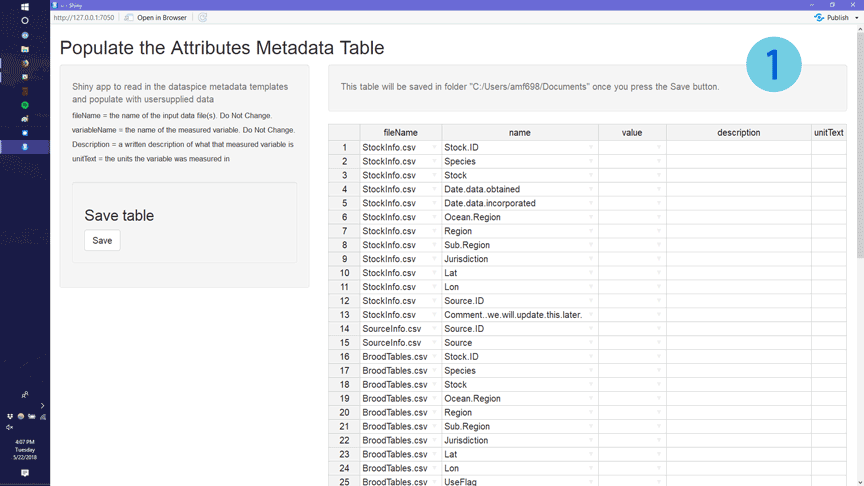

<!-- README.md is generated from README.Rmd. Please edit that file -->
dataspice
=========

[](https://travis-ci.com/ropenscilabs/dataspice)

The goal of dataspice is to make it easier for researchers to create basic, lightweight and concise metadata files for their datasets. These basic files can then be used to:

-   make useful information available during analysis.
-   create a helpful dataset README webpage.
-   produce more complex metadata formats to aid dataset discovery.

Metadata fields are based on [schema.org](http://schema.org/Dataset) and other metadata standards.

Example
-------

A fully worked example can be found [here](https://github.com/amoeba/dataspice-example) and a live preview of the output [here](https://amoeba.github.io/dataspice-example/). An example of how Google sees this can be found [here](https://search.google.com/structured-data/testing-tool/u/0/#url=https%3A%2F%2Famoeba.github.io%2Fdataspice-example%2F).

Installation
------------

You can install the development version from [GitHub](https://github.com/) with:

``` r
# install.packages("devtools")
devtools::install_github("ropenscilabs/dataspice")
```

Workflow
--------

``` r
create_spice()
write_spice() 
build_site()
```


### Create spice

-   `create_spice()` creates template metadata spreadsheets in a folder (by default created in the `data` folder)

The template files are:

-   **attributes.csv** - explains each of the variables in the dataset
-   **biblio.csv** - for spatial and temporal coverage, dataset name, keywords, etc.
-   **access.csv** - for files and file types
-   **creators.csv** - for data authors

### Fill in templates

The user needs to fill in the details of the 4 template files. These csv files can be directly modified, or they can be edited using some helper functions and/or a shiny app. **Helper functions**

-   `prep_attributes()` populates the **fileName** and **variableName** columns of the attributes.csv file using the header row of the data files.

To see an example of how this works, load the data files that ship with the package:

``` r
data_files <- list.files(system.file("example-dataset/", 
                                     package = "dataspice"), 
                         pattern = ".csv",
                        full.names = TRUE)
```

This function assumes that the metadata templates are in a folder called `metadata` within a `data` folder.

``` r
attributes_path <- here::here("data", "metadata",
 "attributes.csv")
```

Using `purrr::map()`, this function can be applied over multiple files to populate the header names

``` r
data_files %>% purrr::map(~prep_attributes(.x, attributes_path),
                         attributes_path = attributes_path)
```

The output of `prep_attributes()` has the first two columns filled out:

<table>
<thead>
<tr>
<th style="text-align:left;">
fileName
</th>
<th style="text-align:left;">
variableName
</th>
<th style="text-align:left;">
description
</th>
<th style="text-align:left;">
unitText
</th>
</tr>
</thead>
<tbody>
<tr>
<td style="text-align:left;">
BroodTables.csv
</td>
<td style="text-align:left;">
Stock.ID
</td>
<td style="text-align:left;">
NA
</td>
<td style="text-align:left;">
NA
</td>
</tr>
<tr>
<td style="text-align:left;">
BroodTables.csv
</td>
<td style="text-align:left;">
Species
</td>
<td style="text-align:left;">
NA
</td>
<td style="text-align:left;">
NA
</td>
</tr>
<tr>
<td style="text-align:left;">
BroodTables.csv
</td>
<td style="text-align:left;">
Stock
</td>
<td style="text-align:left;">
NA
</td>
<td style="text-align:left;">
NA
</td>
</tr>
<tr>
<td style="text-align:left;">
BroodTables.csv
</td>
<td style="text-align:left;">
Ocean.Region
</td>
<td style="text-align:left;">
NA
</td>
<td style="text-align:left;">
NA
</td>
</tr>
<tr>
<td style="text-align:left;">
BroodTables.csv
</td>
<td style="text-align:left;">
Region
</td>
<td style="text-align:left;">
NA
</td>
<td style="text-align:left;">
NA
</td>
</tr>
<tr>
<td style="text-align:left;">
BroodTables.csv
</td>
<td style="text-align:left;">
Sub.Region
</td>
<td style="text-align:left;">
NA
</td>
<td style="text-align:left;">
NA
</td>
</tr>
</tbody>
</table>
**Shiny apps**

Each of the metadata templates can be edited interactively using a shiny app

-   `editAttritubes()` opens a shiny app that can be used to edit `attributes.csv`. The shiny app dispalys the attributes table and lets the user fill in an informative description and units (e.g. meters, hectares, etc.) for each variable.
-   `editAccess()`
-   `editCreators()`
-   `editBiblio()`



Completed metadata tables in this example will look like this:

`access.csv` has one row for each file

| fileName        | name            | contentUrl | fileFormat |
|:----------------|:----------------|:-----------|:-----------|
| StockInfo.csv   | StockInfo.csv   | NA         | CSV        |
| BroodTables.csv | BroodTables.csv | NA         | CSV        |
| SourceInfo.csv  | SourceInfo.csv  | NA         | CSV        |

`attributes.csv` has one row for each variable in each file

| fileName        | variableName | description                                      | unitText |
|:----------------|:-------------|:-------------------------------------------------|:---------|
| BroodTables.csv | Stock.ID     | Unique stock identifier                          | NA       |
| BroodTables.csv | Species      | species of stock                                 | NA       |
| BroodTables.csv | Stock        | Stock name, generally river where stock is found | NA       |
| BroodTables.csv | Ocean.Region | Ocean region                                     | NA       |
| BroodTables.csv | Region       | Region of stock                                  | NA       |
| BroodTables.csv | Sub.Region   | Sub.Region of stock                              | NA       |

`biblio.csv` is one row containing descriptors including spatial and temporal coverage

<table style="width:100%;">
<colgroup>
<col width="14%" />
<col width="41%" />
<col width="4%" />
<col width="2%" />
<col width="5%" />
<col width="1%" />
<col width="1%" />
<col width="4%" />
<col width="3%" />
<col width="3%" />
<col width="3%" />
<col width="3%" />
<col width="2%" />
<col width="4%" />
<col width="4%" />
</colgroup>
<thead>
<tr class="header">
<th align="left">title</th>
<th align="left">description</th>
<th align="left">datePublished</th>
<th align="left">citation</th>
<th align="left">keywords</th>
<th align="left">license</th>
<th align="left">funder</th>
<th align="left">geographicDescription</th>
<th align="right">northBoundCoord</th>
<th align="right">eastBoundCoord</th>
<th align="right">southBoundCoord</th>
<th align="right">westBoundCoord</th>
<th align="left">wktString</th>
<th align="left">startDate</th>
<th align="left">endDate</th>
</tr>
</thead>
<tbody>
<tr class="odd">
<td align="left">Compiled annual statewide Alaskan salmon escapement counts, 1921-2017</td>
<td align="left">The number of mature salmon migrating from the marine environment to freshwater streams is defined as escapement. Escapement data are the enumeration of these migrating fish as they pass upstream, ...</td>
<td align="left">2018-02-12 08:00:00</td>
<td align="left">NA</td>
<td align="left">salmon, alaska, escapement</td>
<td align="left">NA</td>
<td align="left">NA</td>
<td align="left">NA</td>
<td align="right">78</td>
<td align="right">-131</td>
<td align="right">47</td>
<td align="right">-171</td>
<td align="left">NA</td>
<td align="left">1921-01-01 08:00:00</td>
<td align="left">2017-01-01 08:00:00</td>
</tr>
</tbody>
</table>

`creators.csv` has one row for each of the dataset authors

<table>
<colgroup>
<col width="3%" />
<col width="10%" />
<col width="10%" />
<col width="50%" />
<col width="25%" />
</colgroup>
<thead>
<tr class="header">
<th align="left">id</th>
<th align="left">givenName</th>
<th align="left">familyName</th>
<th align="left">affiliation</th>
<th align="left">email</th>
</tr>
</thead>
<tbody>
<tr class="odd">
<td align="left">NA</td>
<td align="left">Jeanette</td>
<td align="left">Clark</td>
<td align="left">National Center for Ecological Analysis and Synthesis</td>
<td align="left"><a href="mailto:jclark@nceas.ucsb.edu">jclark@nceas.ucsb.edu</a></td>
</tr>
<tr class="even">
<td align="left">NA</td>
<td align="left">Rich</td>
<td align="left">Brenner</td>
<td align="left">Alaska Department of Fish and Game</td>
<td align="left">richard.brenner.alaska.gov</td>
</tr>
</tbody>
</table>

### Save json-ld file

-   `write_spice()` generates a json-ld file ("linked data") to aid in [dataset discovery](https://developers.google.com/search/docs/data-types/dataset), creation of more extensive metadata (e.g. [EML](https://knb.ecoinformatics.org/#api)), and creating a website.

### Build website

-   `build_site()` generates an index.html file in the repository `docs` folder, to create a website that shows a simple view of the dataset with the metadata and an interactive map. For example, this [repository](https://github.com/amoeba/dataspice-example) results in a [website](https://amoeba.github.io/dataspice-example/)


Contributors
------------

This package was developed at rOpenSci's 2018 unconf by (in alphabetical order):

-   [Carl Boettiger](https://github.com/cboettig)
-   [Scott Chamberlain](https://github.com/sckott)
-   [Auriel Fournier](https://github.com/aurielfournier)
-   [Kelly Hondula](https://github.com/khondula)
-   [Anna Krystalli](https://github.com/annakrystalli)
-   [Bryce Mecum](https://github.com/amoeba)
-   [Maëlle Salmon](https://github.com/maelle)
-   [Kate Webbink](https://github.com/magpiedin)
-   [Kara Woo](https://github.com/karawoo)
