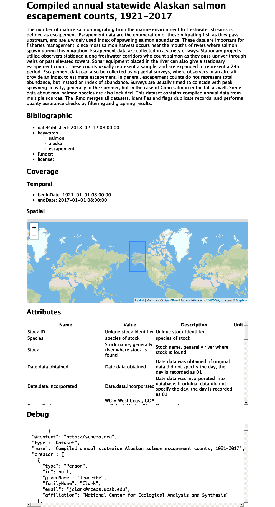

<!-- README.md is generated from README.Rmd. Please edit that file -->
dataspice
=========

The goal of dataspice is to make it easier for researchers to create basic, lightweight and concise metadata files for their datasets. These basic files can then be used to:

-   make useful information available during analysis.
-   create a helpful dataset README webpage.
-   produce more complex metadata formats to aid dataset discovery.

Metadata fields are based on [schema.org](http://schema.org/Dataset) and other metadata standards.

Installation
------------

You can install the development version from [GitHub](https://github.com/) with:

``` r
# install.packages("devtools")
devtools::install_github("ropenscilabs/dataspice")
```

Example
-------

``` r
create_spice()
write_spice() 
build_site()
```


### Create spice

-   `create_spice()` creates template metadata spreadsheets in a folder (by default created in the `data` folder)

The template files are:

-   **attributes.csv** - explains each of the variables in the dataset
-   **biblio.csv** - for spatial and temporal coverage, dataset name, keywords, etc.
-   **access.csv** - for files and file types
-   **creators.csv** - for data authors

### Fill in templates

The user needs to fill in the details of the 4 template files. These csv files can be directly modified, or they can be edited using some helper functions and/or a shiny app. **Helper functions**

-   `prep_attributes()` populates the **fileName** and **variableName** columns of the attributes.csv file using the header row of the data files.

To see an example of how this works, load the data files that ship with the package:

``` r
data_files <- list.files(system.file("example-dataset/", 
                                     package = "dataspice"), 
                         pattern = ".csv",
                        full.names = TRUE)
```

This function assumes that the metadata templates are in a folder called `metadata` within a `data` folder.

``` r
attributes_path <- here::here("data", "metadata",
 "attributes.csv")
```

Using `purrr::map()`, this function can be applied over multiple files to populate the header names

``` r
data_files %>% purrr::map(~prep_attributes(.x, attributes_path),
                         attributes_path = attributes_path)
```

The output of `prep_attributes()` has the first two columns filled out:

    #> Parsed with column specification:
    #> cols(
    #>   fileName = col_character(),
    #>   variableName = col_character(),
    #>   description = col_character(),
    #>   unitText = col_character()
    #> )

| fileName        | variableName                        | description | unitText |
|:----------------|:------------------------------------|:------------|:---------|
| BroodTables.csv | Stock.ID                            | NA          | NA       |
| BroodTables.csv | Species                             | NA          | NA       |
| BroodTables.csv | Stock                               | NA          | NA       |
| BroodTables.csv | Ocean.Region                        | NA          | NA       |
| BroodTables.csv | Region                              | NA          | NA       |
| BroodTables.csv | Sub.Region                          | NA          | NA       |
| BroodTables.csv | Jurisdiction                        | NA          | NA       |
| BroodTables.csv | Lat                                 | NA          | NA       |
| BroodTables.csv | Lon                                 | NA          | NA       |
| BroodTables.csv | UseFlag                             | NA          | NA       |
| BroodTables.csv | BroodYear                           | NA          | NA       |
| BroodTables.csv | TotalEscapement                     | NA          | NA       |
| BroodTables.csv | R0.1                                | NA          | NA       |
| BroodTables.csv | R0.2                                | NA          | NA       |
| BroodTables.csv | R0.3                                | NA          | NA       |
| BroodTables.csv | R0.4                                | NA          | NA       |
| BroodTables.csv | R0.5                                | NA          | NA       |
| BroodTables.csv | R1.1                                | NA          | NA       |
| BroodTables.csv | R1.2                                | NA          | NA       |
| BroodTables.csv | R1.3                                | NA          | NA       |
| BroodTables.csv | R1.4                                | NA          | NA       |
| BroodTables.csv | R1.5                                | NA          | NA       |
| BroodTables.csv | R2.1                                | NA          | NA       |
| BroodTables.csv | R2.2                                | NA          | NA       |
| BroodTables.csv | R2.3                                | NA          | NA       |
| BroodTables.csv | R2.4                                | NA          | NA       |
| BroodTables.csv | R3.1                                | NA          | NA       |
| BroodTables.csv | R3.2                                | NA          | NA       |
| BroodTables.csv | R3.3                                | NA          | NA       |
| BroodTables.csv | R3.4                                | NA          | NA       |
| BroodTables.csv | R4.1                                | NA          | NA       |
| BroodTables.csv | R4.2                                | NA          | NA       |
| BroodTables.csv | R4.3                                | NA          | NA       |
| BroodTables.csv | TotalRecruits                       | NA          | NA       |
| SourceInfo.csv  | Source.ID                           | NA          | NA       |
| SourceInfo.csv  | Source                              | NA          | NA       |
| StockInfo.csv   | X1                                  | NA          | NA       |
| StockInfo.csv   | Stock.ID                            | NA          | NA       |
| StockInfo.csv   | Species                             | NA          | NA       |
| StockInfo.csv   | Stock                               | NA          | NA       |
| StockInfo.csv   | Date.data.obtained                  | NA          | NA       |
| StockInfo.csv   | Date.data.incorporated              | NA          | NA       |
| StockInfo.csv   | Ocean.Region                        | NA          | NA       |
| StockInfo.csv   | Region                              | NA          | NA       |
| StockInfo.csv   | Sub.Region                          | NA          | NA       |
| StockInfo.csv   | Jurisdiction                        | NA          | NA       |
| StockInfo.csv   | Lat                                 | NA          | NA       |
| StockInfo.csv   | Lon                                 | NA          | NA       |
| StockInfo.csv   | Source.ID                           | NA          | NA       |
| StockInfo.csv   | Comment..we.will.update.this.later. | NA          | NA       |

**Shiny apps**

Each of the metadata templates can be edited interactively using a shiny app

-   `editAttritubes()` opens a shiny app that can be used to edit `attributes.csv`. The shiny app dispalys the attributes table and lets the user fill in an informative description and units (e.g. meters, hectares, etc.) for each variable.
-   `editAccess()`
-   `editCreators()`
-   `editBiblio()`

gif of shiny app in use

### Save json-ld file

-   `write_spice()` generates a json-ld file ("linked data") to aid in [dataset discovery](https://developers.google.com/search/docs/data-types/dataset), creation of more extensive metadata (e.g. [EML](https://knb.ecoinformatics.org/#api)), and creating a website.

### Build website

-   `build_site()` generates an index.html file in the repository `docs` folder, to create a website that shows a simple view of the dataset with the metadata and an interactive map.



Contributors
------------

This package was developed at rOpenSci's 2018 unconf by (in alphabetical order):

-   [Carl Boettiger](https://github.com/cboettig)
-   [Scott Chamberlain](https://github.com/sckott)
-   [Auriel Fournier](https://github.com/aurielfournier)
-   [Kelly Hondula](https://github.com/khondula)
-   [Anna Krystalli](https://github.com/annakrystalli)
-   [Bryce Mecum](https://github.com/amoeba)
-   [Maëlle Salmon](https://github.com/maelle)
-   [Kate Webbink](https://github.com/magpiedin)
-   [Kara Woo](https://github.com/karawoo)
