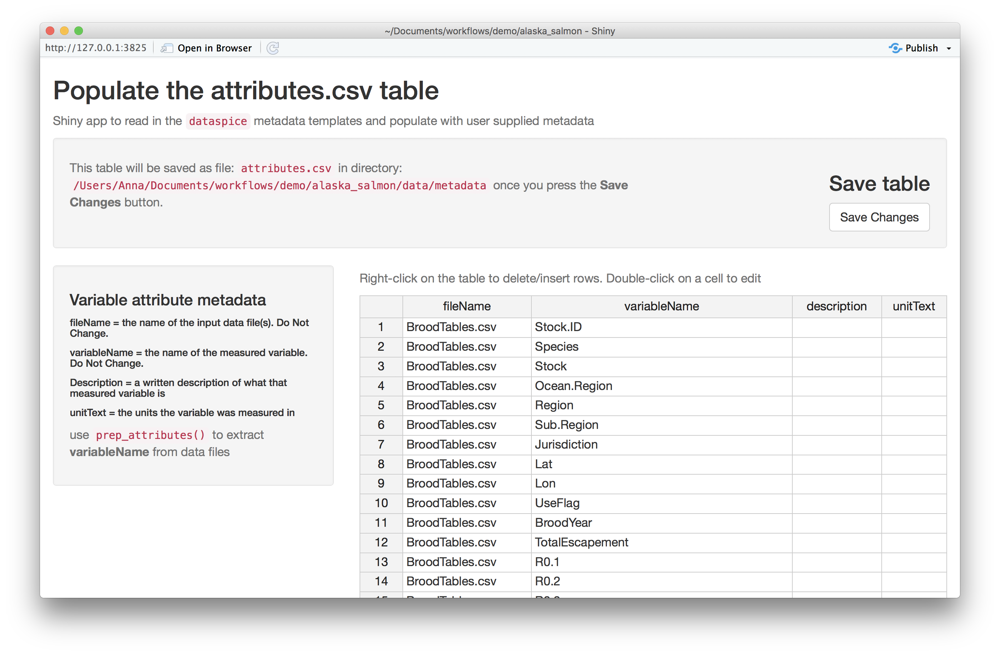

---
output:
  md_document:
    variant: gfm
---

<!-- README.md is generated from README.Rmd. Please edit that file -->

# dataspice


[](https://codecov.io/gh/ropensci/dataspice?branch=main)
[](https://github.com/ropensci/software-review/issues/426)

The goal of `dataspice` is to make it easier for researchers to create
basic, lightweight, and concise metadata files for their datasets by
editing the kind of files they’re probably most familiar with: CSVs. To
spice up their data with a dash of metadata. These metadata files can
then be used to:

-   Make useful information available during analysis.
-   Create a helpful dataset README webpage for your data similar to how
    [pkgdown](https://pkgdown.r-lib.org/) creates websites for R
    packages.
-   Produce more complex metadata formats for richer description of your
    datasets and to aid dataset discovery.

Metadata fields are based on
[Schema.org/Dataset](https://schema.org/Dataset) and other [metadata
standards](#resources) and represent a lowest common denominator which
means converting between formats should be relatively straightforward.

## Example

An basic example repository for demonstrating what using `dataspice`
might look like can be found at
[https://github.com/amoeba/dataspice-example](https://github.com/amoeba/dataspice-example/).
From there, you can also check out a preview of the HTML `dataspice`
generates at
[https://amoeba.github.io/dataspice-example](https://amoeba.github.io/dataspice-example/)
and how Google sees it at
<https://search.google.com/test/rich-results?url=https%3A%2F%2Famoeba.github.io%2Fdataspice-example%2F>.

A much more detailed example has been created by [Anna
Krystalli](https://annakrystalli.me) at
<https://annakrystalli.me/dataspice-tutorial/> ([GitHub
repo](https://github.com/annakrystalli/dataspice-tutorial)).

## Installation

You can install the latest version from
[CRAN](https://cran.r-project.org):

``` r
install.packages("dataspice")
```

## Workflow

``` r
create_spice()
# Then fill in template CSV files, more on this below
write_spice()
build_site() # Optional
```


### Create spice

`create_spice()` creates template metadata spreadsheets in a folder (by
default created in the `data` folder in the current working directory).

The template files are:

-   **biblio.csv** - for title, abstract, spatial and temporal coverage,
    etc.
-   **creators.csv** - for data authors
-   **attributes.csv** - explains each of the variables in the dataset
-   **access.csv** - for files, file types, and download URLs (if
    appropriate)

### Fill in templates

The user needs to fill in the details of the four template files. These
csv files can be directly modified, or they can be edited using either
the associated helper function and/or
[Shiny](https://shiny.rstudio.com/) app.

#### Helper functions

-   `prep_attributes()` populates the **`fileName`** and
    **`variableName`** columns of the `attributes.csv` file using the
    header row of the data files.

-   `prep_access()` populates the **`fileName`**, **`name`** and
    **`encodingFormat`** columns of the `access.csv` file from the files
    in the folder containing the data.

To see an example of how `prep_attributes()` works, load the data files
that ship with the package:

``` r
data_files <- list.files(system.file("example-dataset/", package = "dataspice"),
  pattern = ".csv",
  full.names = TRUE
)
```

This function assumes that the metadata templates are in a folder called
`metadata` within a `data` folder.

``` r
attributes_path <- file.path("data", "metadata", "attributes.csv")
```

Using `purrr::map()`, this function can be applied over multiple files
to populate the header names

``` r
data_files %>%
  purrr::map(~ prep_attributes(.x, attributes_path),
    attributes_path = attributes_path
  )
```

The output of `prep_attributes()` has the first two columns filled out:

<table>
<thead>
<tr>
<th style="text-align:left;">
fileName
</th>
<th style="text-align:left;">
variableName
</th>
<th style="text-align:left;">
description
</th>
<th style="text-align:left;">
unitText
</th>
</tr>
</thead>
<tbody>
<tr>
<td style="text-align:left;">
BroodTables.csv
</td>
<td style="text-align:left;">
Stock.ID
</td>
<td style="text-align:left;">
NA
</td>
<td style="text-align:left;">
NA
</td>
</tr>
<tr>
<td style="text-align:left;">
BroodTables.csv
</td>
<td style="text-align:left;">
Species
</td>
<td style="text-align:left;">
NA
</td>
<td style="text-align:left;">
NA
</td>
</tr>
<tr>
<td style="text-align:left;">
BroodTables.csv
</td>
<td style="text-align:left;">
Stock
</td>
<td style="text-align:left;">
NA
</td>
<td style="text-align:left;">
NA
</td>
</tr>
<tr>
<td style="text-align:left;">
BroodTables.csv
</td>
<td style="text-align:left;">
Ocean.Region
</td>
<td style="text-align:left;">
NA
</td>
<td style="text-align:left;">
NA
</td>
</tr>
<tr>
<td style="text-align:left;">
BroodTables.csv
</td>
<td style="text-align:left;">
Region
</td>
<td style="text-align:left;">
NA
</td>
<td style="text-align:left;">
NA
</td>
</tr>
<tr>
<td style="text-align:left;">
BroodTables.csv
</td>
<td style="text-align:left;">
Sub.Region
</td>
<td style="text-align:left;">
NA
</td>
<td style="text-align:left;">
NA
</td>
</tr>
</tbody>
</table>

#### Shiny helper apps

Each of the metadata templates can be edited interactively using a
[Shiny](https://shiny.rstudio.com/) app:

-   `edit_attributes()` opens a Shiny app that can be used to edit
    `attributes.csv`. The Shiny app displays the current `attributes`
    table and lets the user fill in an informative description and units
    (e.g. meters, hectares, etc.) for each variable.
-   `edit_access()` opens an editable version of `access.csv`
-   `edit_creators()` opens an editable version of `creators.csv`
-   `edit_biblio()` opens an editable version of `biblio.csv`



Remember to click on **Save** when finished editing.

#### Completed metadata files

The first few rows of the completed metadata tables in this example will
look like this:

`access.csv` has one row for each file

| fileName        | name            | contentUrl | encodingFormat |
|:----------------|:----------------|:-----------|:---------------|
| StockInfo.csv   | StockInfo.csv   | NA         | CSV            |
| BroodTables.csv | BroodTables.csv | NA         | CSV            |
| SourceInfo.csv  | SourceInfo.csv  | NA         | CSV            |

`attributes.csv` has one row for each variable in each file

| fileName        | variableName | description                                      | unitText |
|:----------------|:-------------|:-------------------------------------------------|:---------|
| BroodTables.csv | Stock.ID     | Unique stock identifier                          | NA       |
| BroodTables.csv | Species      | species of stock                                 | NA       |
| BroodTables.csv | Stock        | Stock name, generally river where stock is found | NA       |
| BroodTables.csv | Ocean.Region | Ocean region                                     | NA       |
| BroodTables.csv | Region       | Region of stock                                  | NA       |
| BroodTables.csv | Sub.Region   | Sub.Region of stock                              | NA       |

`biblio.csv` is one row containing descriptors including spatial and
temporal coverage

| title                                                                 | description                                                                                                                                                                                            | datePublished       | citation | keywords                   | license | funder | geographicDescription | northBoundCoord | eastBoundCoord | southBoundCoord | westBoundCoord | wktString | startDate           | endDate             |
|:----------------------------------------------------------------------|:-------------------------------------------------------------------------------------------------------------------------------------------------------------------------------------------------------|:--------------------|:---------|:---------------------------|:--------|:-------|:----------------------|----------------:|---------------:|----------------:|---------------:|:----------|:--------------------|:--------------------|
| Compiled annual statewide Alaskan salmon escapement counts, 1921-2017 | The number of mature salmon migrating from the marine environment to freshwater streams is defined as escapement. Escapement data are the enumeration of these migrating fish as they pass upstream, … | 2018-02-12 08:00:00 | NA       | salmon, alaska, escapement | NA      | NA     | NA                    |              78 |           -131 |              47 |           -171 | NA        | 1921-01-01 08:00:00 | 2017-01-01 08:00:00 |

`creators.csv` has one row for each of the dataset authors

| id  | name           | affiliation                                           | email                      |
|:----|:---------------|:------------------------------------------------------|:---------------------------|
| NA  | Jeanette Clark | National Center for Ecological Analysis and Synthesis | <jclark@nceas.ucsb.edu>    |
| NA  | Rich,Brenner   | Alaska Department of Fish and Game                    | richard.brenner.alaska.gov |

### Save JSON-LD file

`write_spice()` generates a json-ld file (“linked data”) to aid in
[dataset
discovery](https://developers.google.com/search/docs/data-types/dataset),
creation of more extensive metadata
(e.g. [EML](https://eml.ecoinformatics.org)), and creating a website.

Here’s a view of the `dataspice.json` file of the example data:


### Build website

-   `build_site()` creates a bare-bones `index.html` file in the
    repository `docs` folder with a simple view of the dataset with the
    metadata and an interactive map. For example, this
    [repository](https://github.com/amoeba/dataspice-example/) results
    in this [website](https://amoeba.github.io/dataspice-example/)


### Convert to EML

The metadata fields `dataspice` uses are based largely on their
compatibility with terms from [Schema.org](https://schema.org). However,
`dataspice` metadata can be converted to Ecological Metadata Language
(EML), a much richer schema. The conversion isn’t perfect but
`dataspice` will do its best to convert your `dataspice` metadata to
EML:

``` r
library(dataspice)

# Load an example dataspice JSON that comes installed with the package
spice <- system.file(
  "examples", "annual-escapement.json",
  package = "dataspice"
)

# Convert it to EML
eml_doc <- spice_to_eml(spice)
#> Warning: variableMeasured not crosswalked to EML because we don't have enough
#> information. Use `crosswalk_variables` to create the start of an EML attributes
#> table. See ?crosswalk_variables for help.
#> You might want to run EML::eml_validate on the result at this point and fix what validations errors are produced. You will commonly need to set `packageId`, `system`, and provide `attributeList` elements for each `dataTable`.
```

You may receive warnings depending on which `dataspice` fields you
filled in and this process will very likely produce an invalid EML
record which is totally fine:

``` r
library(EML)
#> 
#> Attaching package: 'EML'
#> The following object is masked from 'package:magrittr':
#> 
#>     set_attributes

eml_validate(eml_doc)
#> [1] FALSE
#> attr(,"errors")
#> [1] "Element '{https://eml.ecoinformatics.org/eml-2.2.0}eml': The attribute 'packageId' is required but missing."                                  
#> [2] "Element '{https://eml.ecoinformatics.org/eml-2.2.0}eml': The attribute 'system' is required but missing."                                     
#> [3] "Element 'dataTable': Missing child element(s). Expected is one of ( physical, coverage, methods, additionalInfo, annotation, attributeList )."
#> [4] "Element 'dataTable': Missing child element(s). Expected is one of ( physical, coverage, methods, additionalInfo, annotation, attributeList )."
#> [5] "Element 'dataTable': Missing child element(s). Expected is one of ( physical, coverage, methods, additionalInfo, annotation, attributeList )."
```

This is because some fields in `dataspice` store information in
different structures and because EML requires many fields that
`dataspice` doesn’t have fields for. At this point, you should look over
the validation errors produced by `EML::eml_validate` and fix those.
Note that this will likely require familiarity with the [EML
Schema](https://eml.ecoinformatics.org/) and the [EML
package](https://github.com/ropensci/eml).

Once you’re done, you can write out an EML XML file:

``` r
out_path <- tempfile()
write_eml(eml_doc, out_path)
#> NULL
```

### Convert from EML

Like converting `dataspice` to EML, we can convert an existing EML
record to a set of `dataspice` metadata tables which we can then work
from within `dataspice`:

``` r
library(EML)

eml_path <- system.file("example-dataset/broodTable_metadata.xml", package = "dataspice")
eml <- read_eml(eml_path)
```

``` r
# Creates four CSVs files in the `data/metadata` directory
my_spice <- eml_to_spice(eml, "data/metadata")
```

## Resources

A few existing tools & data standards to help users in specific domains:

-   [Darwin Core](http://rs.tdwg.org/dwc/)
-   [Ecological Metadata
    Language](https://knb.ecoinformatics.org/#external//emlparser/docs/index.html)
    (EML) (& [`EML`](https://github.com/ropensci/EML))
-   [ISO 19115](https://www.iso.org/standard/53798.html) - Geographic
    Information Metadata
-   [ISO 19139](https://www.iso.org/standard/32557.html) - Geographic
    Info Metadata XML schema
-   [Minimum Information for Biological and Biomedical
    Investigations](https://fairsharing.org/collection/MIBBI) (MIBBI)

…And others indexed in [Fairsharing.org](https://fairsharing.org) & the
[RDA metadata
directory](http://rd-alliance.github.io/metadata-directory/standards/).

## Code of Conduct

Please note that this package is released with a [Contributor Code of
Conduct](https://ropensci.org/code-of-conduct/). By contributing to this
project, you agree to abide by its terms.

## Contributors

This package was developed at rOpenSci’s 2018 unconf by (in alphabetical
order):

-   [Carl Boettiger](https://github.com/cboettig)
-   [Scott Chamberlain](https://github.com/sckott)
-   [Auriel Fournier](https://github.com/aurielfournier)
-   [Kelly Hondula](https://github.com/khondula)
-   [Anna Krystalli](https://github.com/annakrystalli)
-   [Bryce Mecum](https://github.com/amoeba)
-   [Maëlle Salmon](https://github.com/maelle)
-   [Kate Webbink](https://github.com/magpiedin)
-   [Kara Woo](https://github.com/karawoo)
-   [Irene Steves](https://github.com/isteves)
