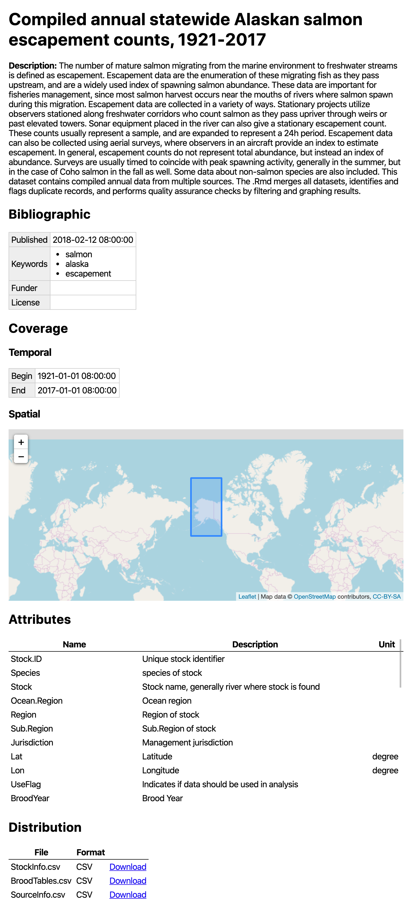

The goal of the `dataspice` package is to make it easier for researchers to create basic, lightweight, and concise metadata files for their datasets. These basic files can then be used to:

 - Make useful information available during analysis.
 - Create a helpful dataset README webpage.
 - Convert to more complex metadata formats to aid dataset discovery.

The `dataspice` metadata fields are based on [Schema.org](https://schema.org/) and and other, richer metadata standards such as [Ecological Metadata Language](https://eml.ecoinformatics.org/).

## Step 1 - Start with one or more data files

To start the user will have one or more datafiles in a common directory. We currently support rectangular data with headers in a .csv file or spatial data with attributes.

## Step 2 - Fill in Templates

`create_spice()` reads in the files from that directory and creates a set of template metadata files for the user to populate. These metadata templates will include some data extracted from the user's datafiles, including things like file names and measured variable names to aid the user in populating the metadata files.

Once these are created, you need to fill in each template file with the remaining metadata.
Templates can be filled either:

1. With the integrated [Shiny](https://shiny.rstudio.com/) applications (`edit_attributes()`, `edit_access()`, `edit_creators()`, `edit_biblio()`)
2. Manually (i.e., with a text or CSV/spreadsheet editor)

For new and even advanced users, option (1) is probably easier and more friendly.

### Metadata Files

- `creators.csv`: One row for each creator, and gives their affiliation, contact email, [ORCID](https://orcid.org/), etc.
- `attributes.csv`: This is where most of the user data entry will take place. For each variable, its name, units, and a written description are filled in.
- `biblio.csv`: Citation information about the project, as much or as little data as possible can be included, but if things like bounding box coordinates are not included, then when the website is generated there will not be a bounding box map generated.
- `access.csv`: Includes a row for each file that was read in, and documents the name of each file and its format.

## Step 3 - Save metadata in JSON

Once the metadata templates are filled in, you can create a single JSON-LD metadata record for your metadata with `write_spice()`.

## Step 4 - Create a dataspice website

A dataset README website is an interactive representation of the JSON information about the data. Assuming sufficient information is provided in the JSON it will include a map of the points and a bounding box of the area of study.

The output from `write_spice()` is fed into `build_site()` to create the website.

